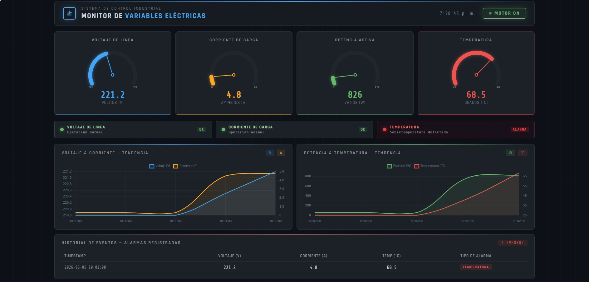
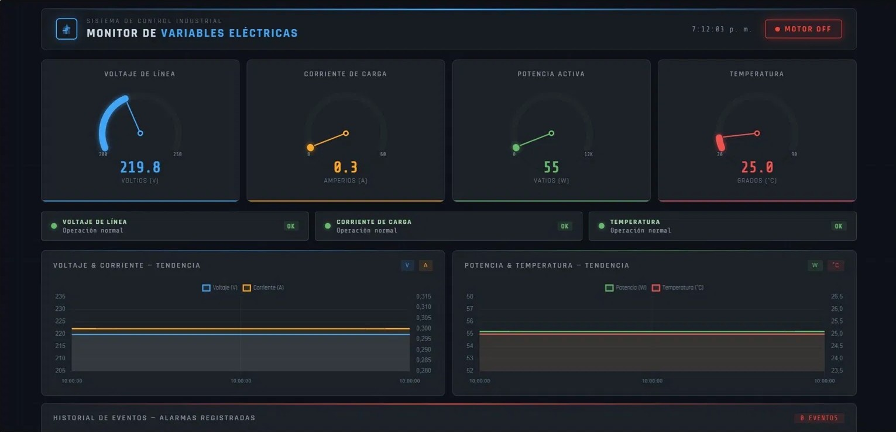
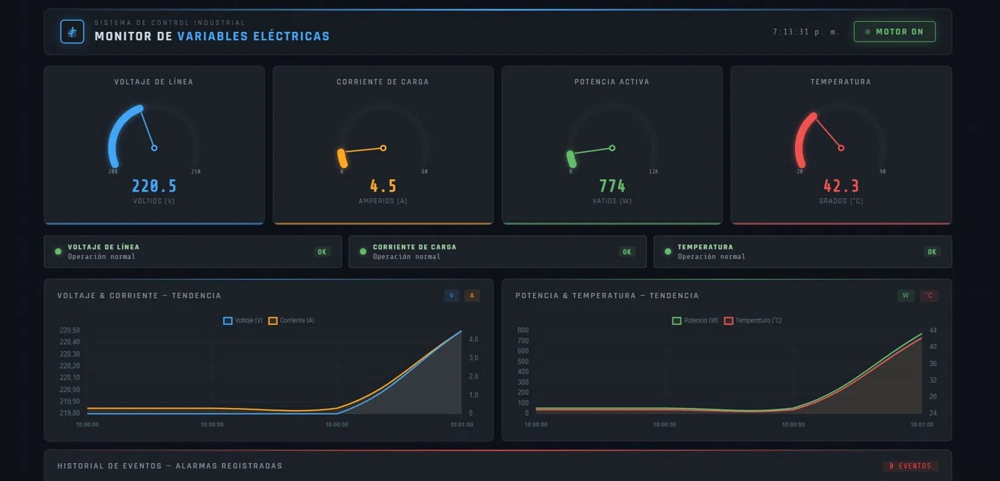

# Sistema SCADA con Nodo Edge IIoT — Monitor de Variables Eléctricas



Sistema de monitoreo industrial en tiempo real que integra un nodo Edge basado en **ESP32**, comunicación segura **MQTT/TLS**, protocolo industrial **Modbus TCP** y un dashboard **SCADA web** desarrollado con Python y Flask. Diseñado para supervisión de variables eléctricas en motores industriales con detección automática de alarmas y notificaciones por email.

---

## Arquitectura del Sistema

```
ESP32 (Nodo Edge)
  │  WiFi + Portal Cautivo
  │  MQTT/TLS — HiveMQ Cloud (puerto 8883)
  ▼
Python — monitor.py
  │  Suscriptor MQTT
  ├── SQLite (histórico de mediciones)
  ├── Alertas Email (SMTP — flanco ascendente)
  └── Flask — app.py
          │  API REST
          ▼
    Dashboard Web
    Chart.js — tiempo real
    Gauges + Gráficas + Historial de alarmas
```

---

## Características

- **Nodo Edge ESP32** con portal cautivo para configuración WiFi sin reprogramar, sincronización horaria NTP y LEDs indicadores de estado
- **Dos versiones de firmware** — producción con sensor PZEM-004T y simulación para pruebas sin hardware
- **Comunicación MQTT/TLS** sobre HiveMQ Cloud con publicación de JSON estructurado cada 2 segundos
- **Dashboard SCADA web** con gauges estilo velocímetro, gráficas de tendencia en tiempo real, panel de alarmas y historial de eventos
- **Base de datos SQLite** para almacenamiento histórico de mediciones
- **Sistema de alarmas** con detección por flanco ascendente y notificación automática por email
- **PCB diseñada en KiCad 8** para integración con sensor PZEM-004T
- Arquitectura preparada para conexión con **PLC vía Modbus TCP**

---

## Firmware ESP32 — Dos Versiones

### `nodo_edge_iiot_sensor.ino` — Producción (con PZEM-004T)
Versión para uso con hardware real. Lee voltaje, corriente, potencia activa, energía acumulada, frecuencia y factor de potencia directamente del sensor PZEM-004T. Detecta automáticamente si el sensor no responde.

### `nodo_edge_iiot_simulacion.ino` — Simulación (sin sensor)
Versión para pruebas del sistema completo sin hardware de medición. Simula un motor industrial 1HP / 220V con comportamiento realista — arranque, carga nominal, calentamiento gradual y generación de alarmas.

---

## Portal Cautivo — Configuración WiFi

El ESP32 incluye un portal cautivo que permite configurar la red WiFi sin necesidad de reprogramar el dispositivo.

### Cómo funciona

**Primera vez (sin credenciales guardadas):**

1. El ESP32 enciende y no encuentra red WiFi configurada
2. Crea automáticamente una red WiFi propia:
   - **Red:** `NodoEdge_Config`
   - **Contraseña:** `nodo1234`
3. Conéctate a esa red desde tu celular o computador
4. Se abre automáticamente una página de configuración en `192.168.4.1`
5. Selecciona tu red WiFi e ingresa la contraseña
6. El ESP32 guarda las credenciales y se conecta

**Siguiente encendido:**
- El ESP32 se conecta automáticamente sin mostrar el portal

**Si necesitas cambiar la red:**
- Mantén presionado el botón RESET por 10 segundos para borrar credenciales
- El portal cautivo se activa de nuevo

### Indicadores LED durante el portal
| LED | Estado | Significado |
|---|---|---|
| WiFi (GPIO23) | Parpadeo rápido | Portal cautivo activo |
| WiFi (GPIO23) | Fijo encendido | WiFi conectado |
| MQTT (GPIO22) | Fijo encendido | HiveMQ conectado |
| Alarma (GPIO21) | Fijo encendido | Variable fuera de rango |

---

## Conexión PZEM-004T al ESP32

```
PZEM-004T          ESP32 DevKit 38 pines
─────────          ──────────────────────
VCC (5V)    →      VIN  (pin 19)
GND         →      GND  (pin 14)
TX          →      GPIO16 / RX2  (pin 28)
RX          →      GPIO17 / TX2  (pin 29)
```

> **Importante:** El PZEM-004T trabaja con 220V en su lado de medición. Maneja las conexiones de alta tensión con precaución.

---

## Variables Monitoreadas

| Variable | Unidad | Rango normal | Umbral de alarma |
|---|---|---|---|
| Voltaje de línea | V | 200 – 240 | > 228 V |
| Corriente de carga | A | 0 – 6 | > 5 A |
| Potencia activa | W | calculada | — |
| Factor de potencia | — | 0.75 – 0.95 | — |
| Temperatura | °C | 25 – 65 | > 65 °C |
| Energía acumulada | kWh | — | — |
| Frecuencia | Hz | 59 – 61 | — |

---

## Stack Tecnológico

### Firmware ESP32
| Librería | Autor | Función |
|---|---|---|
| WiFiManager | tzapu | Portal cautivo para configuración WiFi |
| PubSubClient | Nick O'Leary | Cliente MQTT |
| ArduinoJson | Benoit Blanchon | Serialización JSON |
| PZEM004Tv30 | Jakub Mandula | Lectura sensor PZEM-004T |
| WiFiClientSecure | ESP32 built-in | Conexión TLS/SSL |
| time.h | ESP32 built-in | Sincronización NTP |

### Backend Python
| Librería | Función |
|---|---|
| paho-mqtt | Suscripción al broker MQTT |
| flask | Servidor web y API REST |
| sqlite3 | Base de datos histórica |
| smtplib | Envío de alertas por email |

### Frontend
| Tecnología | Función |
|---|---|
| Chart.js | Gráficas de tendencia en tiempo real |
| HTML/CSS/JS | Dashboard SCADA responsivo |
| SVG | Gauges estilo velocímetro animados |

---

## Estructura del Proyecto

```
sistema-scada-iiot/
│
├── monitor.py                          # Suscriptor MQTT + SQLite + alertas email
├── app.py                              # Servidor Flask + API REST
├── .gitignore
│
├── templates/
│   └── index.html                      # Dashboard SCADA
│
├── static/
│   └── chart.js                        # Librería Chart.js (local)
│
├── nodo_edge_iiot.ino/
│   ├── nodo_edge_iiot_sensor.ino       # Firmware producción (PZEM-004T)
│   └── nodo_edge_iiot_simulacion.ino   # Firmware simulación (pruebas)
│
├── pcb/
│   ├── nodo edge IIot.kicad_sch        # Esquemático
│   ├── nodo edge IIot.kicad_pcb        # Layout PCB
│   └── nodo edge IIot.kicad_pro        # Proyecto KiCad
│
└── docs/
    ├── dashboard_motor_off.jpg         # Dashboard — motor apagado
    ├── dashboard_motor_on.jpg          # Dashboard — motor encendido
    └── dashboard_alarma.jpg            # Dashboard — alarma activa
```

---

## Cómo Correr el Proyecto

### Requisitos Python
```bash
pip install flask paho-mqtt
```

### 1. Iniciar el monitor MQTT
```bash
python monitor.py
```

### 2. Iniciar el servidor web
```bash
python app.py
```

### 3. Abrir el dashboard
```
http://127.0.0.1:5000
```

### 4. Publicar datos de prueba desde HiveMQ
Topic: `industrial/motor/variables`

**Motor apagado:**
```json
{"voltaje":219.8,"corriente":0.3,"potencia":55.2,"factor_potencia":0.92,"temperatura":25.0,"estado_motor":0,"timestamp":"2026-06-05 10:00:00"}
```

**Motor encendido:**
```json
{"voltaje":220.5,"corriente":4.5,"potencia":773.6,"factor_potencia":0.78,"temperatura":42.3,"estado_motor":1,"timestamp":"2026-06-05 10:01:00"}
```

**Alarma de temperatura:**
```json
{"voltaje":221.2,"corriente":4.8,"potencia":826.4,"factor_potencia":0.78,"temperatura":68.5,"estado_motor":1,"timestamp":"2026-06-05 10:02:00"}
```

---

## Capturas del Dashboard

### Motor apagado — operación normal


### Motor encendido — carga nominal


### Alarma activa — sobretemperatura


---

## Autor

**Ricardo Felipe Bravo**  
Ingeniero Electrónico — Universidad de Nariño  
Orientado al sector eléctrico e industrial

📩 ricardofelipebravo12@gmail.com  
🔗 [LinkedIn](https://www.linkedin.com/in/ricardofelipe-bravo)
